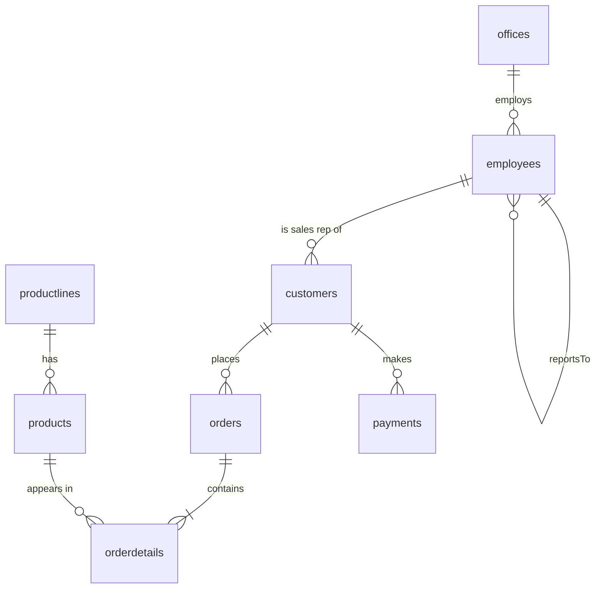

# ClassicModels Query Challenge - Full SQL Project

A complete, ready-to-run SQL project for the **ClassicModels Query Challenge**: a large synthetic database
(**144,821 rows** across 8 tables), **108 solved business questions** covering customers, products and payments,
and everything needed to run it on **MySQL / MariaDB** or on **SQLite** with zero setup.

| | |
|---|---|
| Database | `classicmodels` - 2,500 customers, 500 products, 20,000 orders, 104,824 order lines, 16,933 payments |
| Questions | **36** customer + **33** product + **31** payment + **8** bonus |
| Verified on | MariaDB 10.11 (strict mode, `ONLY_FULL_GROUP_BY`) and SQLite 3 - all 108 queries return identical results |

---

## 1. What is in the box

```
classicmodels_project/
|-- README.md                    <- you are here
|-- sql/
|   |-- 01_schema.sql            MySQL/MariaDB: creates the database + 8 tables (keys, indexes, foreign keys)
|   |-- 02_data.sql              MySQL/MariaDB: 144,821 rows of INSERT statements
|   `-- 03_queries.sql           SOLUTIONS: all 108 questions with the SQL that answers them
|-- results/
|   `-- 04_query_results.md      every query + its actual output (first 10 rows of each)
|-- sqlite/
|   `-- classicmodels.db         the same database as a single SQLite file (no server needed)
|-- data/                        one CSV per table (for Excel, Power BI, Python, import wizards)
`-- scripts/
    |-- run_queries.py           runs all queries on the SQLite file, prints results, writes reports
    |-- load_mysql.sh            one-command loader for a local MySQL/MariaDB server
    `-- generate_dataset.py      rebuilds the whole dataset (seeded, reproducible, resizable)
```

## 2. Quick start

**Option A - MySQL Workbench / MySQL / MariaDB**

1. `File > Run SQL Script...` and run `sql/01_schema.sql`, then `sql/02_data.sql` (about 6 MB, takes a few seconds).
   Or from a terminal: `./scripts/load_mysql.sh root`  (or `mysql -u root -p < sql/01_schema.sql` then the same for `02_data.sql`).
2. Open `sql/03_queries.sql` and run any query you like (`USE classicmodels;` is at the top).

**Option B - no database server (SQLite)**

```bash
python3 scripts/run_queries.py                         # runs all 108 queries, shows row counts
python3 scripts/run_queries.py --only A15,C24 --rows 20   # run selected questions and see the rows
python3 scripts/run_queries.py --section C             # run a whole section
python3 scripts/run_queries.py --report results/04_query_results.md   # rewrite the results report
```
You can also open `sqlite/classicmodels.db` in *DB Browser for SQLite*, *DBeaver* or *VS Code SQLite* and paste queries in.
Python 3.8+ is the only requirement (standard library only).

**Option C - CSV files**: the `data/` folder has one CSV per table (empty cell = `NULL`).

> **Tip - practise first:** the questions are written above every query (`-- Question : ...`). Cover the SQL, write your
> own answer, then compare. `results/04_query_results.md` shows what a correct answer must return.

## 3. The database



| Table | Rows | What it holds | Key columns |
|---|---:|---|---|
| `customers` | 2,500 | B2B customers in 23 countries | `customerNumber`, `customerName`, `city`, `state`, `country`, `salesRepEmployeeNumber`, `creditLimit` |
| `employees` | 47 | executives, managers and sales reps | `employeeNumber`, `jobTitle`, `reportsTo`, `officeCode` |
| `offices` | 10 | sales offices worldwide | `officeCode`, `city`, `country`, `territory` |
| `productlines` | 7 | product categories | `productLine`, `textDescription` |
| `products` | 500 | catalogue of scale models | `productCode`, `productName`, `productLine`, `productScale`, `productVendor`, `quantityInStock`, `buyPrice`, `MSRP` |
| `orders` | 20,000 | sales orders (2022-01-03 to 2026-09-22) | `orderNumber`, `orderDate`, `requiredDate`, `shippedDate`, `status`, `customerNumber` |
| `orderdetails` | 104,824 | order line items | `orderNumber`, `productCode`, `quantityOrdered`, `priceEach` |
| `payments` | 16,933 | customer payments (2022-01-15 to 2026-09-24) | `customerNumber`, `checkNumber`, `paymentDate`, `amount` |

**Built-in edge cases** (so the trickier questions have something to find): 99 customers have no sales rep,
302 customers never paid, 2 sales reps have no customers yet, 21 products were never ordered,
some customers have a credit limit of 0, and a few orders are cancelled, on hold, disputed or late.

**Headline numbers:** 16,933 payments totalling **277,304,212.64** (average 16,376.56, smallest 241.20,
largest 60,168.04). Biggest customer market: **USA** (613 customers); biggest payer country: **USA**.

## 4. Question index

Sections A-C use only the skills from the brief - **no JOINs required**. Section D is optional bonus material.

### Skill coverage (Sections A-C)

| Skill | Questions using it (A-C) | Examples |
|---|---|---|
| `SELECT` | 100 | A01, A02, A03, A04, A05 |
| `WHERE` | 61 | A02, A03, A04, A09, A10 |
| `ORDER BY` | 75 | A01, A02, A03, A05, A06 |
| `GROUP BY` | 33 | A06, A07, A08, A09, A15 |
| `HAVING` | 13 | A07, A08, A16, A26, A35 |
| `LIKE` | 11 | A18, A19, A20, A21, A22 |
| `IN` / `NOT IN` | 16 | A03, A04, A20, A29, A30 |
| `LIMIT` | 53 | A01, A02, A03, A08, A09 |
| `OFFSET` | 3 | A32, B31, C30 |
| Aggregate functions (`COUNT`, `SUM`, `AVG`, `MIN`, `MAX`) | 60 | A04, A06, A07, A08, A09 |
| Subqueries | 23 | A16, A28, A29, A30, A31 |

### A - Customer Analysis

| ID | Topic | Skills |
|---|---|---|
| A01 | List customer locations | SELECT, ORDER BY, LIMIT |
| A02 | Customers in the USA | WHERE, ORDER BY, LIMIT |
| A03 | Customers in France, Germany or Spain | WHERE, IN, ORDER BY, LIMIT |
| A04 | Customers outside North America | WHERE, NOT IN, COUNT |
| A05 | Countries we sell to | SELECT DISTINCT, ORDER BY |
| A06 | Customers per country | GROUP BY, COUNT, ORDER BY |
| A07 | Major customer countries | GROUP BY, HAVING, COUNT |
| A08 | Customer-heavy cities | GROUP BY (two columns), HAVING, LIMIT |
| A09 | Customers with no state recorded | WHERE ... IS NULL, GROUP BY, LIMIT |
| A10 | Very high credit limits | WHERE, ORDER BY, LIMIT |
| A11 | Mid-range credit limits | WHERE, BETWEEN, COUNT |
| A12 | Top 10 credit limits | ORDER BY, LIMIT |
| A13 | Lowest non-zero credit limits | WHERE, ORDER BY, LIMIT |
| A14 | Customers with no credit | WHERE, ORDER BY, LIMIT |
| A15 | Credit limit statistics by country | GROUP BY, COUNT, AVG, MIN, MAX, SUM, ROUND |
| A16 | Countries with above-average credit | GROUP BY, HAVING, subquery |
| A17 | Overall credit exposure | SUM, AVG, MIN, MAX |
| A18 | Names starting with 'A' | LIKE 'A%', ORDER BY, LIMIT |
| A19 | Names containing 'Gift' | LIKE '%Gift%', ORDER BY, LIMIT |
| A20 | Limited companies in the UK, Ireland or Australia | LIKE, AND, IN, LIMIT |
| A21 | Contact person search | LIKE with two patterns, AND |
| A22 | Single-character wildcard | LIKE '_a%', ORDER BY, LIMIT |
| A23 | City search | LIKE, GROUP BY, COUNT |
| A24 | Customers of one sales rep | WHERE, ORDER BY, LIMIT |
| A25 | Customers per sales rep | GROUP BY, COUNT, ORDER BY, LIMIT |
| A26 | Overloaded sales reps | GROUP BY, HAVING |
| A27 | Customers without a sales rep | WHERE ... IS NULL, ORDER BY, LIMIT |
| A28 | Customers of the busiest sales rep | subquery in WHERE, GROUP BY, ORDER BY, LIMIT |
| A29 | Sales reps with no customers | NOT IN subquery, WHERE |
| A30 | Reps serving Japan | IN subquery |
| A31 | Above-average credit limit | subquery, ORDER BY, LIMIT |
| A32 | Pagination - page 3 | ORDER BY, LIMIT, OFFSET |
| A33 | Customers who never paid | NOT IN subquery, ORDER BY, LIMIT |
| A34 | Customers who never ordered | NOT IN subquery, COUNT |
| A35 | Big-spending customers | IN subquery with GROUP BY / HAVING / SUM |
| A36 | Highest credit limit in each country | correlated subquery, MAX |

### B - Product Analysis

| ID | Topic | Skills |
|---|---|---|
| B01 | Product catalogue | SELECT, ORDER BY, LIMIT |
| B02 | Classic Cars | WHERE, ORDER BY, LIMIT |
| B03 | Motorcycles, planes and ships | WHERE, IN, ORDER BY, LIMIT |
| B04 | Products that are not cars | NOT IN, COUNT |
| B05 | Expensive to buy | WHERE, ORDER BY, LIMIT |
| B06 | Retail price band | WHERE, BETWEEN, COUNT |
| B07 | Top 10 most expensive products | ORDER BY, LIMIT |
| B08 | 5 cheapest products | ORDER BY, LIMIT |
| B09 | Products per line | GROUP BY, COUNT, ORDER BY |
| B10 | Average prices per line | GROUP BY, AVG, ROUND |
| B11 | Premium lines | GROUP BY, HAVING, AVG |
| B12 | Price range per line | GROUP BY, MIN, MAX |
| B13 | Low stock | WHERE, ORDER BY, LIMIT |
| B14 | Critical stock by line | WHERE, GROUP BY, COUNT |
| B15 | Total stock per line | GROUP BY, SUM |
| B16 | Lines with big inventory | GROUP BY, HAVING, SUM |
| B17 | Healthy stock band | WHERE, BETWEEN, ORDER BY, LIMIT |
| B18 | Overstocked products | WHERE, ORDER BY, LIMIT |
| B19 | Name contains 'Ford' | LIKE '%Ford%', ORDER BY |
| B20 | Name starts with '1969' | LIKE '1969%', ORDER BY |
| B21 | Description search | LIKE on a text column, AND, IN |
| B22 | Vendor search | LIKE, GROUP BY, COUNT |
| B23 | Biggest vendors | GROUP BY, HAVING |
| B24 | Scale filter | WHERE, AND, IN, ORDER BY, LIMIT |
| B25 | Multi-column sort | ORDER BY (three keys), LIMIT |
| B26 | Best margins | calculated columns, ROUND, ORDER BY, LIMIT |
| B27 | Above-average price | subquery in WHERE and in SELECT |
| B28 | Most expensive product in each line | correlated subquery, MAX |
| B29 | Products never ordered | NOT IN subquery, ORDER BY, LIMIT |
| B30 | Best sellers | GROUP BY, SUM, subquery in SELECT, ORDER BY, LIMIT |
| B31 | Pagination - page 5 | ORDER BY, LIMIT, OFFSET |
| B32 | Product with the most stock | subquery with MAX |
| B33 | Above the average of its own line | correlated subquery, AVG |

### C - Payment Analysis

| ID | Topic | Skills |
|---|---|---|
| C01 | Latest payments | ORDER BY, LIMIT |
| C02 | Payments in 2025 | WHERE, BETWEEN (dates), ORDER BY, LIMIT |
| C03 | Q4 2025 cash-in | WHERE, BETWEEN, COUNT, SUM |
| C04 | A specific month | WHERE with YEAR() and MONTH(), COUNT, SUM |
| C05 | Payments per year | GROUP BY YEAR(), COUNT, SUM |
| C06 | Payments per month in 2025 | WHERE, GROUP BY MONTH(), COUNT, SUM |
| C07 | Busiest payment months | GROUP BY (two expressions), COUNT, ORDER BY, LIMIT |
| C08 | First and last payment | MIN, MAX on dates |
| C09 | Payments before 2024 | WHERE, NOT IN, COUNT |
| C10 | Best payment days | GROUP BY, SUM, ORDER BY, LIMIT |
| C11 | Most active payers | GROUP BY, COUNT, ORDER BY, LIMIT |
| C12 | Frequent payers | GROUP BY, HAVING, COUNT, LIMIT |
| C13 | One-time payers | derived table (subquery in FROM), HAVING, COUNT |
| C14 | Payers above the typical frequency | HAVING with a subquery |
| C15 | Customers who paid in 2024 and 2025 | IN with two subqueries, COUNT |
| C16 | Japanese customers' payments | IN subquery, SUM, COUNT |
| C17 | Check number search | LIKE 'H%', COUNT |
| C18 | Top 10 customers by total paid | GROUP BY, SUM, COUNT, subquery in SELECT, ORDER BY, LIMIT |
| C19 | Customers with low lifetime payments | GROUP BY, HAVING, SUM |
| C20 | High average payers | GROUP BY, HAVING AVG, ORDER BY, LIMIT |
| C21 | Total payments received | SUM, COUNT |
| C22 | Average payment | AVG, ROUND |
| C23 | Smallest and largest payment | MIN, MAX |
| C24 | Payment summary in one row | COUNT, SUM, AVG, MIN, MAX |
| C25 | Payments over 50,000 | WHERE, ORDER BY, LIMIT |
| C26 | Payment band | BETWEEN, COUNT, SUM |
| C27 | Above-average payments | subquery in WHERE, COUNT |
| C28 | The largest payment ever | subquery with MAX, subquery in SELECT |
| C29 | The smallest payment ever | subquery with MIN |
| C30 | Pagination - page 2 | ORDER BY, LIMIT, OFFSET |
| C31 | Very large payments | WHERE, GROUP BY, COUNT, ORDER BY, LIMIT |

### D - Bonus - JOINs & business insights

| ID | Topic | Skills |
|---|---|---|
| D01 | Payments by country | INNER JOIN, GROUP BY, SUM, COUNT |
| D02 | Top 10 customers with their sales rep | multi-table JOIN, GROUP BY, SUM |
| D03 | Revenue by product line | JOIN, SUM of a calculated column, GROUP BY |
| D04 | Sales rep performance | JOIN, GROUP BY, SUM, COUNT DISTINCT |
| D05 | Late shipments | WHERE comparing two columns, COUNT, subquery |
| D06 | Largest orders | GROUP BY, SUM of a calculated column, ORDER BY, LIMIT |
| D07 | Yearly revenue trend | JOIN, YEAR(), GROUP BY, SUM |
| D08 | Payment size buckets | CASE, GROUP BY, COUNT, SUM |

## 5. Notes

* **The data is synthetic.** It follows the well-known `classicmodels` schema (same 8 tables and columns), but every customer,
  product and amount is generated with a fixed random seed. Any resemblance to real companies is coincidental.
* **Need a different size?** `python3 scripts/generate_dataset.py --customers 5000 --orders 60000` rebuilds `sql/02_data.sql`,
  the CSVs and the SQLite file (add `--seed N` for a different dataset). Re-run your MySQL load afterwards.
* **Dates.** The dataset's "today" is 2026-09-24. Questions that mention specific years (2024, 2025, 2026) refer to data that exists
  in this database.
* **SQLite vs MySQL.** `run_queries.py` adds MySQL's `YEAR()` / `MONTH()` and half-up `ROUND()` to SQLite so the same SQL text works
  on both engines. If you paste queries straight into a plain SQLite shell, replace `YEAR(x)` with `CAST(strftime('%Y', x) AS INTEGER)`
  and `MONTH(x)` with `CAST(strftime('%m', x) AS INTEGER)`.
* **Sorting ties.** Where a question asks for "top N", ties are broken by an extra `ORDER BY` column so results are repeatable.
* **The reference project file.** The Google Drive folder from the brief could not be opened while building this project, so the questions
  were written from the topics and skills listed in the brief (customer locations, credit limits, searches, sales reps, payments; product
  prices, lines, stock, searches, sorting; payment dates, counts, activity, totals, averages, min/max). If your file words a question
  differently, find the closest ID in the index above - the same pattern will apply.
# Classic_Models_project
